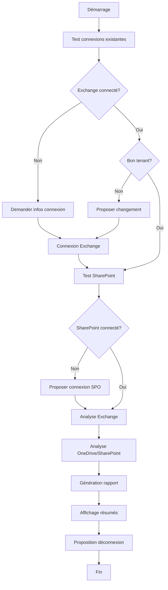

# 📊 Script d'Analyse Microsoft 365 - Stockage et Coûts

[](https://docs.microsoft.com/en-us/powershell/)
[](https://opensource.org/licenses/MIT)
[](https://www.microsoft.com/microsoft-365)

## 📋 Description

Script PowerShell unifié pour analyser l'utilisation du stockage dans Microsoft 365 et calculer les coûts de sauvegarde. Il analyse automatiquement Exchange Online, SharePoint Online et OneDrive for Business avec gestion complète des connexions multi-tenant.

### ✨ Fonctionnalités principales

- 🔐 **Connexion automatique** avec détection des sessions existantes
- 📧 **Analyse Exchange Online** : Toutes les boîtes aux lettres (utilisateurs, partagées, salles, équipements)
- 💾 **Analyse OneDrive** : Stockage personnel de tous les utilisateurs
- 🌐 **Analyse SharePoint** : Sites d'équipe, communication et hub
- 📊 **Rapports détaillés** avec export CSV
- 💰 **Calcul automatique** des coûts de sauvegarde
- 🔄 **Gestion multi-tenant** avec déconnexion sécurisée
- 🌍 **Interface en français** sans accents pour compatibilité

## 🛠️ Prérequis

### Modules PowerShell requis
```powershell
# Installation des modules (exécuter en tant qu'administrateur)
Install-Module -Name ExchangeOnlineManagement -Force
Install-Module -Name Microsoft.Online.SharePoint.PowerShell -Force
```

### Permissions Microsoft 365
- **Exchange Administrator** ou **Global Administrator**
- **SharePoint Administrator** (optionnel pour OneDrive/SharePoint)
- Permissions de lecture sur les boîtes aux lettres

### Versions compatibles
- **PowerShell 5.1+** (Windows PowerShell)
- **PowerShell 7+** (PowerShell Core)
- **Windows 10/11** ou **Windows Server 2016+**

## 🚀 Installation

### Téléchargement direct
```bash
# Cloner le repository
git clone https://github.com/votre-username/m365-storage-analyzer.git
cd m365-storage-analyzer

# Ou télécharger directement le script
curl -O https://raw.githubusercontent.com/votre-username/m365-storage-analyzer/main/Analyse-M365-Unifie.ps1
```

### Configuration de l'exécution
```powershell
# Autoriser l'exécution de scripts (si nécessaire)
Set-ExecutionPolicy -ExecutionPolicy RemoteSigned -Scope CurrentUser
```

## 📖 Utilisation

### Exécution simple
```powershell
# Utilise les connexions existantes ou demande les informations
.\Analyse-M365-Unifie.ps1
```

### Exécution avec paramètres
```powershell
# Analyser un tenant spécifique
.\Analyse-M365-Unifie.ps1 -TenantCible "monentreprise" -EmailAdmin "admin@monentreprise.com"

# Avec chemin de rapport personnalisé
.\Analyse-M365-Unifie.ps1 -CheminRapport "D:\Rapports\MonAnalyse.csv"

# Combinaison complète
.\Analyse-M365-Unifie.ps1 -TenantCible "client1" -EmailAdmin "admin@client1.com" -CheminRapport "C:\Rapports\Client1.csv"
```

### Paramètres disponibles

| Paramètre | Type | Description | Exemple |
|-----------|------|-------------|---------|
| `TenantCible` | String | Nom du tenant à analyser | `"monentreprise"` |
| `EmailAdmin` | String | Email de l'administrateur | `"admin@entreprise.com"` |
| `CheminRapport` | String | Chemin du fichier CSV de sortie | `"C:\Rapports\analyse.csv"` |

## 📊 Rapports générés

### Fichier CSV
Le script génère un fichier CSV avec les colonnes suivantes :
- **Tenant** : Nom du tenant Microsoft 365
- **Service** : Exchange, OneDrive, SharePoint
- **TypeBoite** : UserMailbox, SharedMailbox, OneDrive, etc.
- **Utilisateur** : Nom d'affichage
- **Email** : Adresse email ou URL
- **TailleGB** : Taille en gigaoctets
- **NombreElements** : Nombre d'éléments (pour Exchange)
- **DernierAcces** : Dernière connexion

### Résumé console
- Statistiques par service (Exchange, OneDrive, SharePoint)
- Détail par type de boîte Exchange
- Top 10 des plus gros consommateurs
- Coût estimé de sauvegarde (0,15$/GB/mois)

## 🔧 Workflow du script



## 🛡️ Sécurité

### Gestion des connexions
- **Authentification interactive** uniquement
- **Aucun stockage** de mots de passe
- **Déconnexion sécurisée** des sessions PowerShell
- **Préservation** des applications locales (OneDrive, Outlook, Teams)

### Validation des données
- **Validation email** avec regex
- **Gestion d'erreurs** robuste
- **Timeout** et retry automatiques
- **Logs détaillés** pour le débogage

## 🔍 Dépannage

### Erreurs courantes

#### "The term 'Connect-ExchangeOnline' is not recognized"
```powershell
# Solution : Installer le module Exchange
Install-Module -Name ExchangeOnlineManagement -Force
Import-Module ExchangeOnlineManagement
```

#### "Access denied" lors de la connexion
```powershell
# Vérifier les permissions dans le portail M365
# L'utilisateur doit avoir le rôle Exchange Administrator ou Global Administrator
```

#### "No mailboxes found"
```powershell
# Vérifier les permissions avec ces commandes de test :
Get-OrganizationConfig
Get-Mailbox -ResultSize 1
```

#### Problèmes d'encodage (caractères bizarres)
```powershell
# Le script configure automatiquement l'UTF-8, mais vous pouvez forcer :
chcp 65001
[Console]::OutputEncoding = [System.Text.Encoding]::UTF8
```

### Logs et diagnostic
```powershell
# Activer les logs détaillés
$VerbosePreference = "Continue"
.\Analyse-M365-Unifie.ps1 -Verbose

# Tester les connexions manuellement
Get-PSSession
Get-OrganizationConfig
Get-SPOTenant
```

## 🔄 Développement et contribution

### Structure du code
```
Analyse-M365-Unifie.ps1
├── Fonctions utilitaires
│   ├── Convert-SizeToGB()
│   └── Disconnect-PowerShellSessions()
├── Gestion des connexions
│   ├── Test Exchange
│   ├── Test SharePoint  
│   └── Connexions automatiques
├── Analyses
│   ├── Exchange Online
│   ├── OneDrive for Business
│   └── SharePoint Online
└── Génération rapports
    ├── Export CSV
    ├── Résumés console
    └── Calculs de coûts
```

### Améliorations possibles
- [ ] Support pour Teams (stockage des fichiers)
- [ ] Analyse des archives Exchange
- [ ] Export en format Excel avec graphiques
- [ ] Historique des analyses avec comparaisons
- [ ] Interface graphique (WPF/WinForms)
- [ ] Support pour GCC/GCC High
- [ ] Intégration avec Azure Cost Management
- [ ] Notifications par email des rapports

### Tests
```powershell
# Tests unitaires pour les fonctions
Describe "Convert-SizeToGB" {
    It "Converts MB to GB correctly" {
        Convert-SizeToGB "1024 MB" | Should -Be 1
    }
}

# Tests d'intégration
Describe "Exchange Connection" {
    It "Should connect successfully" {
        # Test avec tenant de développement
    }
}
```

## 📈 Métriques et performances

### Temps d'exécution typiques
- **50 boîtes aux lettres** : ~2-3 minutes
- **200 boîtes aux lettres** : ~8-10 minutes  
- **500 boîtes aux lettres** : ~20-25 minutes
- **1000+ boîtes aux lettres** : ~45+ minutes

### Optimisations
- Traitement en parallèle pour gros volumes
- Cache des résultats pour éviter les re-requêtes
- Pagination intelligente pour SharePoint

## 🤝 Contribution

### Comment contribuer
1. **Fork** le projet
2. **Créer** une branche feature (`git checkout -b feature/AmazingFeature`)
3. **Commiter** vos changements (`git commit -m 'Add AmazingFeature'`)
4. **Pusher** vers la branche (`git push origin feature/AmazingFeature`)
5. **Ouvrir** une Pull Request

### Guidelines de code
- **Commentaires** en français
- **Noms de variables** explicites
- **Gestion d'erreurs** systématique
- **Tests** pour les nouvelles fonctionnalités

## 📄 Licence

Ce projet est sous licence MIT - voir le fichier [LICENSE.md](LICENSE.md) pour les détails.

```
MIT License

Copyright (c) 2024 [Votre Nom]

Permission is hereby granted, free of charge, to any person obtaining a copy
of this software and associated documentation files (the "Software"), to deal
in the Software without restriction, including without limitation the rights
to use, copy, modify, merge, publish, distribute, sublicense, and/or sell
copies of the Software...
```

## 👥 Auteurs

- **[Votre Nom]** - *Développement initial* - [VotreGitHub](https://github.com/votre-username)

## 🙏 Remerciements

- Équipe Microsoft 365 pour les APIs PowerShell
- Communauté PowerShell pour les bonnes pratiques
- Contributeurs et testeurs du projet

## 📞 Support

- **Issues GitHub** : [Créer un ticket](https://github.com/votre-username/m365-storage-analyzer/issues)
- **Discussions** : [Forum du projet](https://github.com/votre-username/m365-storage-analyzer/discussions)
- **Email** : votre.email@example.com

## 🔗 Liens utiles

- [Documentation Microsoft 365 PowerShell](https://docs.microsoft.com/en-us/microsoft-365/enterprise/manage-microsoft-365-with-microsoft-365-powershell)
- [Exchange Online PowerShell](https://docs.microsoft.com/en-us/powershell/exchange/exchange-online-powershell)
- [SharePoint Online PowerShell](https://docs.microsoft.com/en-us/powershell/sharepoint/sharepoint-online/connect-sharepoint-online)
- [Bonnes pratiques PowerShell](https://docs.microsoft.com/en-us/powershell/scripting/developer/cmdlet/strongly-encouraged-development-guidelines)

---

## 📊 Badges et statistiques


**⭐ Si ce projet vous aide, n'hésitez pas à lui donner une étoile !**